# 聚會點餐機

一群人出去玩，到店後各自用自己的手機開同一個連結點餐，最後一起結帳。

**線上位址：https://ordering-food-mu.vercel.app**

---

出去玩最麻煩的一段，不是玩，是結帳。

十個人坐一桌，菜單傳一圈，有人點三樣、有人只喝一杯，中間那鍋湯大家分。到最後要算錢，一張紙傳過來傳過去，算到一半有人問「欸我那杯飲料算了沒」，整張又要重來。

我想要的其實很簡單：大家各自在自己手機上點，系統幫我算兩件事——一份給店家叫餐，一份算每個人要付多少。

就這樣。沒有帳號、不用註冊、不綁金流。開一攤，把連結丟群組，剩下的自己會長出來。

## 這是什麼

一句話：一個「開一攤、大家各自點、最後幫你把帳算好」的網頁。

它其實只在做一件事——把一桌人零散的點餐，收斂成兩份彙總：

- **一份給店家**：把所有人相同的品項合併起來，不管是誰點的，這是要念給櫃檯的那份。
- **一份給收錢的人**：每個人各自要付多少，算好、含分單。

中間那些傳紙條、按計算機、口頭喊「你那個多少」的過程，全部收進手機裡。

**為什麼是「各自點」，不是一個人統一收單。** 出去玩的情境跟辦公室團購不一樣——大家就坐在同一桌，人到齊了才點，臨時加一份、中途改主意都很正常。與其一個人拿著紙筆問一圈，不如每個人在自己手機上點自己的，發起人只要在最後負責結帳。這也是為什麼點餐頁很輕，重心全放在「清單」跟「結帳」。

**這是給互相認識的人用的工具，不是對外營業系統。** 朋友、同事、家人，彼此信任。這個前提決定了後面幾乎所有設計：不做帳號（知道連結就進得來、也看得到全桌點了什麼，這在一起出遊的情境下本來就是公開資訊）、價格可以自己填（菜單沒有的東西先點了再補價）、狀態誰都能改（服務生把菜端上桌，旁邊誰看到誰按）。換成陌生人的場景，這些取捨都不成立；但這個 App 不服務那個場景。

**三種身分，對應現場真實的分工。** 一起吃飯的人裡，多數是「參與者」，只管點自己的。但發起人自己也在吃飯，收拾殘局（補價、改備註、跟店家點完推進度）常常是坐他旁邊那個人在做，所以有「協助管理者」這一層可以幫忙改所有人的單。發起人則是「最高管理者」，多了指派權限、結束點餐、刪整攤的能力。權限可以在現場臨時交出去，不必事先設定。

**手機優先，開連結就用。** 版面最大 500px、單欄、主要操作固定在底部拇指可及的地方。不用下載 App、不用裝任何東西，把連結點開就是。

下面照著實際用一次的順序走一遍。截圖是拿 Soshow Bar 這家店開的一攤「墾丁第二天晚餐」，三個人：阿德（發起人）、小美、阿凱。

## 開一攤

首頁只有三件事：開一攤、用代碼加入、看目前還在收單的攤。

開一攤要填的東西也少——挑一家店、給這攤取個名字、寫下你自己的名字。名字是結帳時拿來算錢用的，所以一定要填。截止時間是選填，出去玩幾乎用不到，就收在後面折起來。

按下去會拿到一組 6 碼代碼（例如 `JUJRWZ`）跟一條邀請連結。連結丟群組，大家點進來就是同一攤。

<table>
<tr>
<td>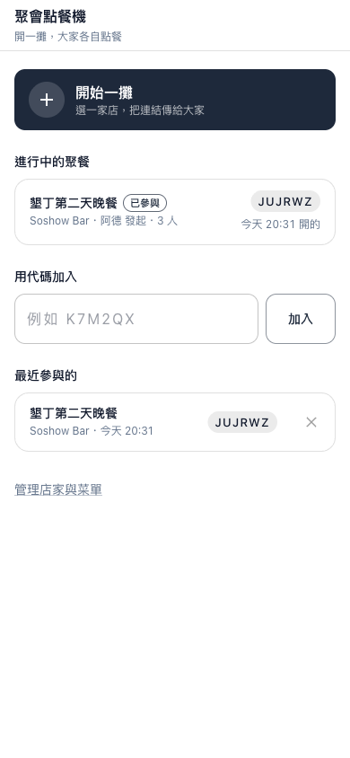</td>
<td>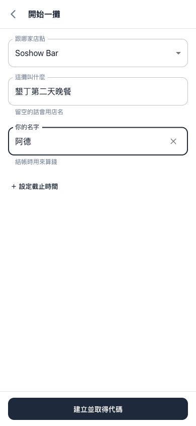</td>
</tr>
<tr>
<td align="center">首頁：開一攤、用代碼加入、進行中的聚餐</td>
<td align="center">開一攤：選店、取名、寫自己的名字</td>
</tr>
</table>

## 先登記你是誰

點進一攤，第一件事是登記暱稱。

這一步看起來多餘，其實是被逼出來的。早期沒有這一步，每次送單都要重打一次名字，結果同一個人打成「小明」「小明 」「明」，結帳就多出三個人。所以現在暱稱先固定下來，之後點餐都用這個身分，不必再打。

登記出來的其實就是一張「還沒有品項的訂單」。有了這張單，別人要把東西分給你一起付時，才選得到你。

登記完就是菜單。菜單照店家分好的類別排（主食、小點、湯品、炸物），點一下加進購物車，再點一下加數量。菜單上沒有的東西，按「自己填一個」——珍奶、店家臨時推的隱藏菜，先點了結帳再補價格都行。

<table>
<tr>
<td></td>
<td>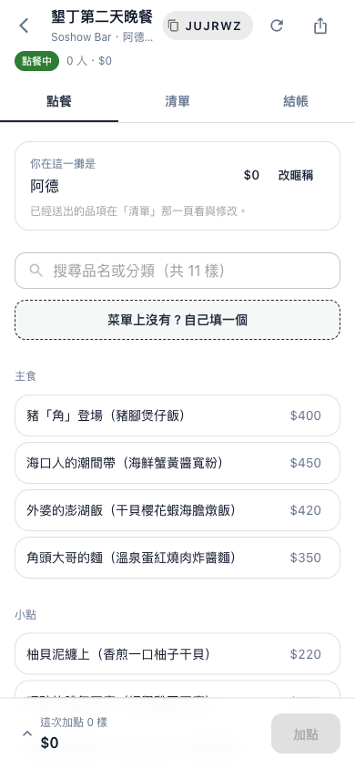</td>
</tr>
<tr>
<td align="center">進一攤先登記暱稱，這一攤就固定這個身分</td>
<td align="center">菜單照類別排，點一下加入，可自己填品項</td>
</tr>
</table>

## 分單，這攤最花心思的地方

一瓶酒、一鍋湯、一大盤炸物，不是一個人吃的。記在誰頭上，那個人就被多收。

所以每一樣東西自己說明「該分給誰」：只有我自己、全部平分，或指定的幾個人。點鉛筆改品項時就能選。

<table>
<tr>
<td>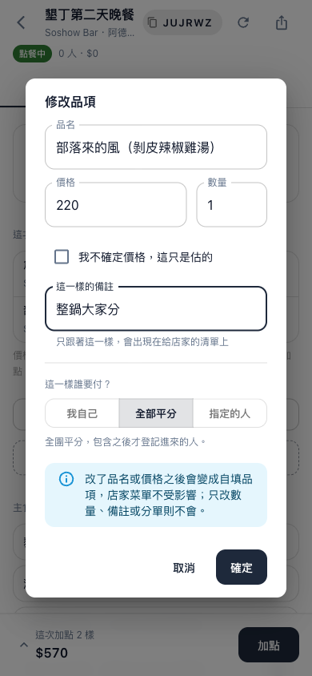</td>
</tr>
<tr>
<td align="center">改品項：品名、價格、數量、備註，還有「這一樣誰要付」</td>
</tr>
</table>

這裡有個我特別小心的地方：**分到的金額不寫進資料庫，一律在讀取時重算。**

原因是「全部平分」的分母會變。一鍋湯本來三個人分，晚到的阿凱又坐下來，就變四個人分。如果金額當初就寫死在資料庫，這時要回頭去改一票不相干的列，漏改一列就是一筆對不起來的帳。

還有除不盡的零頭。220 元三個人分，73 加 73 加 73 是 219，少一塊。這一塊以一元為單位輪流分配，每一樣輪流從不同的人開始扣——固定從第一個人扣的話，排最前面那個人每一筆除不盡的都被多收一元。這樣算下來，總和永遠等於原本的金額。

## 清單：誰點了什麼、餐到了沒

點餐頁只管挑東西。挑完送出的結果，跟別人送出的結果是同一份資料，所以「已經點了什麼」統一在「清單」頁看。自己那張置頂。

清單頁最上面是進度，但只有管理者看得到。進度把每一樣攤開來，照名稱或叫單時間排。要跟店家開口的人得知道那幾樣「未點單」到底是什麼、誰點的，光給個數字沒用。

進度也能批次推：跟店家點完這一輪，按一顆「全部標為已點單」，只會動到還沒點的，已經到餐的不受影響。

每個品項都有狀態——未點單、已點單、已到餐，另外還有撤單。**這是唯一不需要任何憑證就能改的動作**：服務生把酒端上桌時，點的人可能正在廁所，要求本人來按等於這個功能不會被用。同桌的人誰看到誰按。

<table>
<tr>
<td>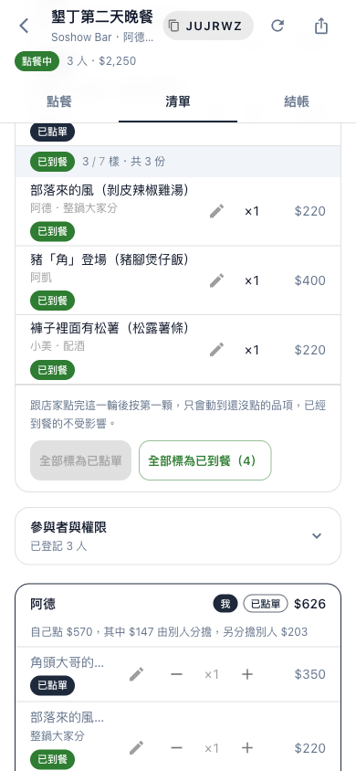</td>
<td>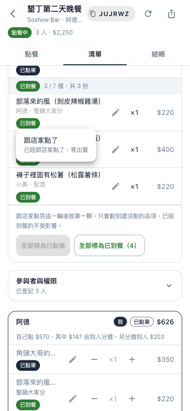</td>
</tr>
<tr>
<td align="center">進度攤開每一樣、可批次推；管理者限定</td>
<td align="center">品項狀態點一下就能改，不需憑證</td>
</tr>
</table>

清單往下是每個人的訂單，帶著分單算完的數字。像阿德這張：自己點了 $570，其中 $147 是別人幫他分擔的、他另外幫別人分擔了 $203，最後要付 $626。點過的東西狀態也在這裡看。

<table>
<tr>
<td>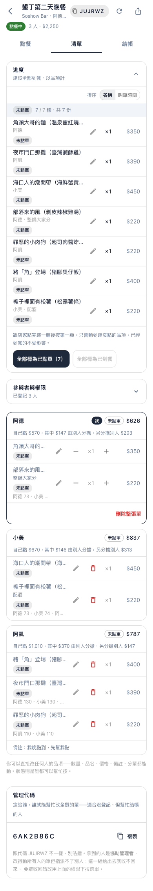</td>
</tr>
<tr>
<td align="center">清單頁全貌：進度、每個人的單、最底下的管理代碼</td>
</tr>
</table>

## 三層權限：發起人自己也在吃飯

發起人不會整晚盯著手機。收拾殘局——補價、改備註、把某一樣挪去分帳、跟店家點完推進度——常常是坐他旁邊那個人在做。

所以權限分三層：

| 角色 | 能做什麼 |
|---|---|
| 參與者 | 只改自己的單，已跟店家點過的品項改不了品名與數量 |
| 協助管理者 | 改所有人的品項、批次推進度，不受截止時間限制 |
| 最高管理者 | 再加上指派別人的權限、結束或重新開放點餐、刪除整攤 |

把管理權交出去有兩條路，刻意做成等價。一條是清單頁最底下那組 8 碼**管理代碼**，念給誰、誰就是協助管理者——不必事先登記，很適合「自己沒點什麼、但幫忙結帳」的人。另一條是在清單頁的權限下拉，**直接指派**某個已登記的參與者，用他原本的身分就有權限，隨時收得回來，也給得出最高管理者。

<table>
<tr>
<td>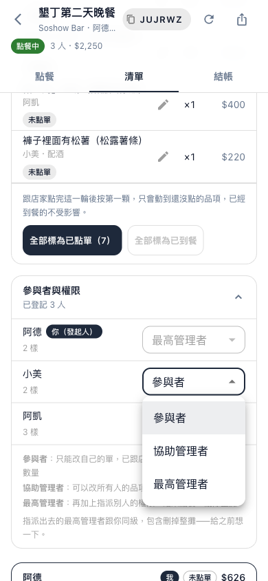</td>
</tr>
<tr>
<td align="center">清單頁指派權限：參與者／協助管理者／最高管理者</td>
</tr>
</table>

管理代碼跟指派的差別在「收不收得回來」。代碼一旦念出去就收不回來，所以拿到代碼的人指派不了任何人——能拿代碼再生出更多管理者的話，就再也收束不了。指派則是在清單頁點下拉選單，降得回去。

最高管理者可以再指派最高管理者，包含把「刪整攤」的權力也給出去。這聽起來危險，但發起人的憑證不在訂單表裡，被指派的人再怎麼互相降權都動不到他，他永遠收得回來。

## 結帳：這攤真正的產出

關掉點餐，結帳頁一次給三份東西。

**給店家的訂單**：把所有人相同的品項合併起來，不分是誰點的、也不管進度——這是要念給店家或櫃檯的那份。

**每個人要付多少**：一人一行，自己點多少、幫別人分擔多少，加起來就是應付。收錢的人看這份。

**分單一覽**：哪幾樣被分著付、每個人各分到幾塊。有人覺得金額不對時，答案在這裡——連 73／73／74 那一塊零頭是怎麼分的都寫出來。

三份都能一鍵複製成純文字，直接貼 LINE 或丟給試算表。

<table>
<tr>
<td>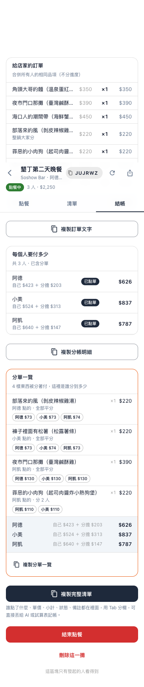</td>
</tr>
<tr>
<td align="center">結帳頁：給店家的訂單、每人應付、分單一覽，都可複製</td>
</tr>
</table>

## 店家與菜單

店家跟菜單是先建好的，開攤時挑一家綁上去。

新開一家店最花時間的不是填店名，是後面那幾十樣品項。而那份菜單通常已經以某種形式存在了——店家給的清單、上次的試算表、照片打的字。所以菜單可以直接**貼一整份 CSV** 進去：一行一樣，品名、價格、分類、排序、價格待確認。

解析放在前端，貼上之後先告訴你「這 23 樣會進去、第 5 行有問題」，你看過才按下去。整批成立或整批退回，不會留下匯入到一半的菜單讓人不知道從哪接。

菜單品項後續也能改品名、價格、分類，或直接下架。已經送出的訂單會保留當時的價格快照，不受影響。

<table>
<tr>
<td>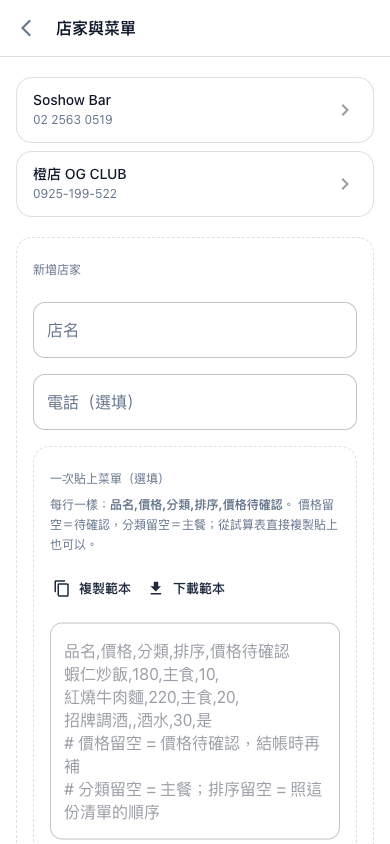</td>
<td>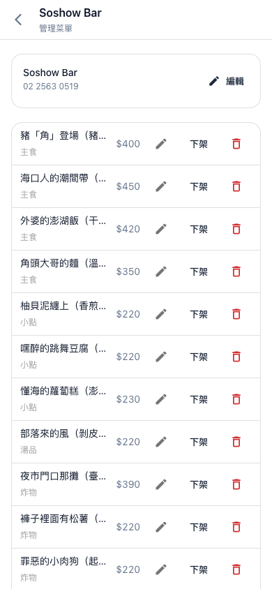</td>
</tr>
<tr>
<td align="center">新增店家：可以直接貼一整份 CSV 菜單</td>
<td align="center">單一店家的菜單管理，逐樣可改可下架</td>
</tr>
</table>

## 那些小地方

大功能上面講完了。真正讓一攤點得順的，其實是一堆平常不會特別注意、但少了就卡卡的小地方。

**點餐的時候**

- **名字會記住。** 填過的名字存在自己手機裡，換一攤時直接跳出來讓你點，不用重打。而且會自動把「這一攤已經有人用過的名字」濾掉——省得兩個人選到同一個。
- **菜單能搜。** 幾十樣的菜單懶得滑，直接打品名或分類（「炸」「湯」）就篩出來。
- **購物車出現兩次。** 一份在上面給剛挑完的人，一份收合在最底下——已經滑到菜單深處、想再確認一下才送出的人，不必捲回頂端。
- **價格可以先估。** 自填品項勾一個「我不確定價格，這只是估的」，先把東西點下去，結帳頁會把估的部分標出來提醒大家核對。

**清單的時候**

- **每 15 秒自己更新。** 大家坐同一桌，別人剛加了什麼、餐到了沒，不用一直按重新整理。切到別的分頁時會停，切回來馬上補一次。頁首也留了一顆手動的，給「我現在就要看到」的時候。
- **進度能換排序。** 照名稱看是「這個人點了什麼」，照叫單時間看是「哪幾樣是這一輪加的」，跟店家對單時兩種都用得到。
- **批次推進度只動落後的。** 跟店家點完一輪，按「全部標為已點單」只會推還沒點的，已經到餐的不會被打回去。
- **撤單留得下紀錄。** 點錯、不要了，走「撤單」而不是刪掉——已撤單不列入金額也不進叫餐清單，但那筆還在，事後對得出來是誰撤了什麼。

**結帳與首頁**

- **每一份彙總都能一鍵複製成文字。** 給店家的訂單、每人應付、分單一覽、完整清單，四份分開複製，貼 LINE 或丟試算表都行，不必手打。
- **首頁分兩塊。** 「進行中的聚餐」列出現在還收得了單的攤，不必先有連結也看得到；「最近參與的」是自己手機記下來的，點進去就有身分。已經被發起人刪掉的攤，進首頁時會自動從清單移除，不會點進去撲空。
- **沒設截止時間的攤，顯示「幾點開的」** 而不是掰一個假的截止時間——那個時間點根本沒人約好。
- **深層連結重新整理不會壞。** 直接開 `/g/JUJRWZ` 或按重新整理都正常進得去，不會 404。

## 幾個沒寫在畫面上的決定

**不做帳號系統。** 零阻力是這個工具的價值，要求註冊會直接殺掉使用率。改用四種憑證對應三個角色：團號（URL 裡）、自己那張單的 token、8 碼管理代碼、發起人的 admin token。除了團號都存在瀏覽器的 localStorage，換手機就得請管理者代勞。權限判斷一律在後端，前端的按鈕只是體驗。

**狀態屬於品項，不屬於訂單。** 聚會是一輪一輪點的，先點的已經到餐時後加的還沒跟店家開口，整張單根本沒有單一狀態。所以訂單沒有狀態欄位，整張的狀態由最落後的那一項推導。

**價格只信任到「自填」為止。** 自填品項要能填價格，就不能像一般點餐系統那樣完全不信前端；但菜單上的品項還是由伺服器決定價格，避免有人不小心把 90 元的排骨飯改成 9 元。金額永遠由伺服器重算，前端送來的一律丟掉。

**同一攤不允許同名。** 結帳按名字算錢，兩個「小明」是實質錯帳，用唯一索引擋掉。

**純 CSR 的前端。** 手機優先，版面最大 500px 置中。這是內部工具、要登記才看得到內容，沒有 SEO 需求，也就沒必要背 SSR 的複雜度。大家坐同一桌，清單每 15 秒輪詢一次，別人剛加了什麼、餐到了沒，不必一直按重新整理。

更完整的設計取捨、資料模型與 API 契約，見下面幾份文件：

- 架構設計：[`docs/ARCHITECTURE.md`](docs/ARCHITECTURE.md)
- API 完整參考（含用程式批次改菜單）：[`docs/API.md`](docs/API.md)
- 後續功能規劃：[`docs/ROADMAP.md`](docs/ROADMAP.md)

---

# 技術

| 層 | 技術 |
|---|---|
| 前端 | React 19 + Vite + MUI 7 + TanStack Router／Query（純 CSR） |
| 後端 | Node 22 + Express 5 + Drizzle ORM（`pg` 驅動） |
| 資料庫 | Neon Postgres（新加坡） |
| 部署 | Vercel（新加坡 `sin1`） |

前端走純 CSR：Vite 產出的 `index.html` 只有一個空的 `#root`，路由由 TanStack Router 在瀏覽器解析，資料由 TanStack Query 抓取與快取。伺服器只負責 `/api/*` 與把靜態檔送出去。

## 後端分層

`/api/*` 底下一律走同一條路：

```
routes/         路徑 → controller 的對照表，不放任何邏輯
controllers/    唯一碰得到 req／res 的一層：驗證 body、讀憑證、決定狀態碼
services/       商業規則：權限、狀態轉移、截止時間、transaction 邊界
repositories/   全部的 Drizzle 查詢，第一個參數一律是 executor（db 或 tx）
```

`lib/` 在這條線之外：純函式，不碰資料庫也不碰 Express（狀態機、分單、計價、序列化、zod schema）。

## 一份程式碼，兩種執行方式

Express app 的「組裝」與「監聽」分開，同一份路由能在兩種環境跑：

```
server/app.js          createApp()，只組裝不監聽
  ├── server/index.js    一般 Node 主機：Express 同時提供 API 與靜態檔
  └── api/index.js       Vercel：靜態檔由 CDN 送出，函式只處理 /api/*
```

兩個 serverless 專屬的處理：`api/index.js` 會在 `req.url` 缺少 `/api` 前綴時補回；`server/db.js` 偵測到 `process.env.VERCEL` 時把連線池上限設為 1，真正的併發交給 Neon 的 pooler。

## 為什麼 App 與資料庫同區

一次頁面載入會打三次資料庫，跨區成本要乘以三。實測（從台灣）：

| 配置 | 使用者→App | App→DB ×3 | 實際總延遲 |
|---|---|---|---|
| **新加坡 + 新加坡（目前）** | 50ms | 約 6ms | **約 200ms** |
| 台北 + 美東 Neon | 10ms | 600ms | 約 610ms |
| 加州 + 美東 Neon | 130ms | 195ms | 約 325ms |

台北機房離使用者最近，但每次查詢都要跨太平洋，反而最慢。選 Vercel 而非其他免費平台，關鍵在冷啟動——一群人坐在餐廳裡同時開連結，第一個人等一分鐘是不能接受的。

---

# 本機開發

```bash
# 1. 安裝
npm install

# 2. 設定資料庫連線
cp .env.example .env
#    到 https://neon.tech 建立免費專案，把 pooled connection string 填進 DATABASE_URL

# 3. 建立資料表與初始資料
npm run migrate
npm run seed

# 4. 啟動（後端 :3000、前端 :5173，Vite 會把 /api 代理到後端）
npm run dev
```

開啟 http://localhost:5173 ，手機測試用同網段 IP 連 `http://<內網IP>:5173`（`dev` 已帶 `--host`）。

## 測試

```bash
npm run dev:server   # 另開一個終端機
npm run smoke        # 163 項端對端測試
```

驗證價格信任模型、權限控制、訂單狀態機、撤單金額排除、同名擋單、關團與截止時間等行為。測試資料以 `[smoke]` 開頭並在結束後自動清除，可安全對正式環境執行（`SMOKE_BASE_URL=<url> npm run smoke`）。

## 部署

目前尚未連結 GitHub 自動部署，每次手動：

```bash
npm run deploy             # 正式環境
npm run deploy:preview     # 預覽環境
```

`scripts/deploy.sh` 會先提醒工作區有沒有未提交／未 push 的變更（Vercel CLI 上傳的是本機檔案，不是 GitHub 上那份），部署完再驗健康檢查、`/api/groups/active`、未知 API 回 404、深層路由回 200。改結構的流程是先寫 SQL 再同步 schema：新增 `server/migrations/000N_*.sql`、跑 `npm run migrate`、再把 `server/schema.js` 改成一致，不要用 `drizzle-kit push` 或 `generate`。部署細節見 [`docs/ARCHITECTURE.md`](docs/ARCHITECTURE.md)。

---

# 專案結構

```
api/index.js              Vercel serverless 進入點

server/
├── app.js                createApp()，組裝 Express（不監聽）
├── index.js              一般 Node 主機進入點
├── db.js                 pg 連線池、Drizzle 實例與 transaction helper
├── schema.js             Drizzle schema（資料表、索引、關聯）
├── routes/               路徑 → controller 對照，不放邏輯
├── controllers/          HTTP 邊界：驗證輸入、讀憑證、決定狀態碼
├── services/             商業規則、權限、transaction
├── repositories/         全部的 Drizzle 查詢，第一個參數一律是 db 或 tx
├── lib/                  純邏輯：roles／pricing／orderStatus／split／validate／serialize／codes
├── migrations/           SQL migration 與執行器
├── seed.js               初始店家與菜單
└── smoke.js              端對端測試

client/src/
├── pages/{Home,NewGroup,Group,Stores,StoreMenu}.jsx
├── components/{ui,OrderTab,ItemStatusChip,ItemEditDialog,ShareSelect,
│               GroupManage,ManageCodeCard,PeopleList,Summary,MenuCsvImport}.jsx
└── lib/{api,queries,storage,orderStatus,roles,menuCsv}.js
```

---

# 已知事項

- **不做帳號系統**：知道團號的人就看得到該攤所有人的訂單。朋友一起出遊的情境下這本來就是共享資訊。
- **憑證存 localStorage**：換手機或清快取後改不了自己的單，此時由管理者代改代刪。管理代碼給出去收不回來，要能收回請改用清單頁的權限下拉。
- **自填價格無法核對**：打錯價格會影響對帳，彙總頁把自填與「價格待確認」的品項標示出來讓大家核對。
- **Neon 連線可能 ETIMEDOUT**：`server/db.js` 已用 `net.setDefaultAutoSelectFamily(false)` 搭配 `dns.setDefaultResultOrder('ipv4first')` 處理 Happy Eyeballs 在無 IPv6 路由時卡住的問題，搬動資料庫連線時記得沿用。
- `DATABASE_URL` 必須使用 pooled endpoint（主機名稱含 `-pooler`）。
- Vercel Hobby 方案條款為非商業用途。
- 本專案為 public repo，`.env` 由 `.gitignore` 排除，提交前務必確認資料庫憑證未進版控。
