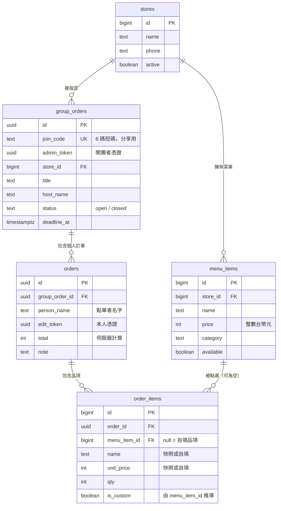

# 團購訂餐系統 — 架構設計

> 本文取代先前的「餐廳點餐系統」設計。`supabase/` 目錄下的 SQL 屬於舊設計（餐廳掃碼點餐、Supabase 直連、無 Node 後端），與本架構不相容，可刪除。

## 1. 產品定義

一群互相認識的人（同事、朋友）一起訂餐：有人**開團**並指定店家，其他人用團號加入、各自點餐並填上名字，時間到**關團**，最後產出兩份彙總——一份給店家叫餐，一份給收錢的人。

這是**內部工具**，不是對外營業系統。使用者彼此信任，這個前提決定了後面所有的權限與價格設計。

## 2. 需求對照

| 你的需求 | 設計對應 |
|---|---|
| React 前端 | Vite + React + Tailwind |
| 手機版為主，最大 500px 置中 | 見 §8 版面約束 |
| Node.js 後端 | Node 22 + Express + `pg` |
| 可選多個店家不同菜單 | `stores` ← `menu_items`，開團時綁定店家 |
| 可自填菜名和價格 | `order_items.menu_item_id` 可為 null，見 §6 |
| 點單附上自己的名字 | `orders.person_name` |
| 儲存進資料庫 | Neon Postgres |

## 3. 架構

```
┌─────────────────────────────────┐        ┌──────────────────┐
│  Zeabur — 單一 Node 服務          │        │  Neon Postgres   │
│                                 │        │                  │
│  Express                        │  TCP   │  stores          │
│   /api/*        JSON API        │───────▶│  menu_items      │
│   /*            React build 靜態 │        │  group_orders    │
│                                 │        │  orders          │
│  同一個 domain，無 CORS 問題       │        │  order_items     │
└─────────────────────────────────┘        └──────────────────┘
```

**為什麼是單一服務**：前後端同源，省掉 CORS 設定與第二個服務的維運。輕量專案不需要拆。

**冷啟動可以接受**：Zeabur 免費方案的 Node 服務會休眠。先前評估餐廳現場點餐時我判定不可接受（客人站在櫃檯等），但團購的使用節奏是「中午前陸續下單」，第一個人多等三秒無感。這是本情境相對寬鬆的地方。

## 4. 資料模型



### DDL

```sql
create table stores (
  id         bigint generated always as identity primary key,
  name       text not null,
  phone      text,
  note       text,
  active     boolean not null default true,
  created_at timestamptz not null default now()
);

create table menu_items (
  id         bigint generated always as identity primary key,
  store_id   bigint not null references stores(id) on delete cascade,
  name       text not null,
  price      int  not null check (price >= 0),
  category   text not null default '主餐',
  available  boolean not null default true,
  sort_order int  not null default 0
);

create table group_orders (
  id          uuid primary key default gen_random_uuid(),
  join_code   text not null unique,
  admin_token uuid not null default gen_random_uuid(),
  store_id    bigint not null references stores(id),
  title       text not null,
  host_name   text not null,
  status      text not null default 'open' check (status in ('open','closed')),
  deadline_at timestamptz,
  created_at  timestamptz not null default now()
);

create table orders (
  id             uuid primary key default gen_random_uuid(),
  group_order_id uuid not null references group_orders(id) on delete cascade,
  person_name    text not null,
  note           text,
  edit_token     uuid not null default gen_random_uuid(),
  total          int  not null default 0 check (total >= 0),
  created_at     timestamptz not null default now(),
  updated_at     timestamptz not null default now()
);

create table order_items (
  id           bigint generated always as identity primary key,
  order_id     uuid   not null references orders(id) on delete cascade,
  menu_item_id bigint references menu_items(id),          -- null = 自填
  name         text   not null,
  unit_price   int    not null check (unit_price >= 0),
  qty          int    not null check (qty > 0),
  is_custom    boolean generated always as (menu_item_id is null) stored
);

create index idx_menu_store   on menu_items   (store_id, category, sort_order);
create index idx_orders_group on orders       (group_order_id);
create index idx_items_order  on order_items  (order_id);
```

**三個設計決策**

`order_items` 一律儲存 `name` 與 `unit_price`，`menu_item_id` 只是「這筆是從哪個菜單品項來的」的參照。這讓「菜單品項」與「自填品項」用同一張表表達，彙總與計價的程式碼完全不必分岔——這是支援自填功能最省事的模型。

金額一律用**整數台幣元**。浮點數在對帳時遲早出錯。

`join_code` 是 6 碼短碼（排除 `0OIl1` 等易混淆字元），因為它會被口頭念出來或貼在群組裡；`admin_token` 和 `edit_token` 則是 uuid，不需要人讀。

## 5. 身分與權限：無登入的 token 模型

**完全不做帳號系統。** 團購的價值在於零阻力，要求註冊會直接殺掉使用率。

改用三種憑證：

| 憑證 | 誰持有 | 能做什麼 | 存在哪 |
|---|---|---|---|
| `join_code` | 團裡所有人 | 看團、看所有人的訂單、加入自己的單 | URL |
| `edit_token` | 下單本人 | 修改／刪除自己那筆訂單 | localStorage |
| `admin_token` | 開團者 | 關團、改截止時間、代刪任何訂單 | localStorage |

伺服器端以 HTTP header 驗證（`X-Edit-Token`、`X-Admin-Token`），前端的按鈕顯示與否只是體驗，**權限判斷一律在後端**。

已知取捨：知道團號的人可以看到團內所有人點了什麼。辦公室情境下這本來就是公開資訊（大家要一起看彙總），因此接受。

## 6. 價格信任模型

這是本系統最需要小心的地方。「自填價格」表示**不能像一般點餐系統那樣完全不信任前端**，但也不該因此全盤開放。

分兩種情況處理，判斷依據是前端有沒有送 `menuItemId`：

```
有 menuItemId  → 忽略前端送的 name 與 price
                 從 menu_items 讀取真實資料
                 驗證該品項屬於本團的 store 且 available

無 menuItemId  → 採用前端送的 name 與 price（自填）
                 驗證 name 非空且 ≤ 50 字
                 驗證 price 介於 0 ~ 9999
```

`total` **永遠由伺服器重算**，前端送來的金額一律丟棄。

換句話說，信任只開放到「自填品項」這個範圍內，菜單上的品項依然由伺服器決定價格。這樣可以避免「有人不小心把 90 元的排骨飯改成 9 元」這種非惡意但會造成對帳混亂的狀況。

## 7. API 契約

```
# 店家與菜單
GET    /api/stores                      列出啟用中的店家
POST   /api/stores                      新增店家
GET    /api/stores/:id/menu             取得店家菜單
POST   /api/stores/:id/menu             新增菜單品項
PATCH  /api/menu-items/:id              修改／上下架

# 團
POST   /api/groups                      開團 → { joinCode, adminToken }
GET    /api/groups/:joinCode            團資訊 + 所有訂單 + 彙總
PATCH  /api/groups/:joinCode            關團／改截止時間   [X-Admin-Token]

# 個人訂單
POST   /api/groups/:joinCode/orders     送出訂單 → { orderId, editToken }
PUT    /api/orders/:orderId             修改訂單            [X-Edit-Token]
DELETE /api/orders/:orderId             刪除訂單            [X-Edit-Token 或 X-Admin-Token]
```

送單 payload：

```jsonc
{
  "personName": "小明",
  "note": "不要香菜",
  "items": [
    { "menuItemId": 12, "qty": 1 },                          // 菜單品項，價格由伺服器決定
    { "name": "自己加的珍奶", "unitPrice": 60, "qty": 2 }      // 自填品項
  ]
}
```

`GET /api/groups/:joinCode` 的回應同時包含兩份彙總，因為這是本系統真正的產出：

- **依品項彙總**：合併所有人的相同品項 → 給店家叫餐用
- **依人彙總**：每個人的品項與應付金額 → 給收錢的人用

## 8. 前端結構與版面約束

### 版面

```
最大寬度 500px，水平置中
單欄，不做響應式斷點（桌機上就是中間一條）
主要操作固定在底部（拇指可及）
可點擊目標最小 44×44px
頁首固定顯示：團名、店家、截止時間倒數
```

Tailwind：`<div className="mx-auto max-w-[500px] min-h-dvh">`。用 `min-h-dvh` 而非 `min-h-screen`，避免手機瀏覽器網址列造成的高度跳動。

### 路由

| 路由 | 內容 |
|---|---|
| `/` | 開新團 ／ 輸入團號加入 |
| `/new` | 開團：選店家、團名、你的名字、截止時間 |
| `/g/:joinCode` | 團主頁，三個 tab：**點餐** ／ **大家點了什麼** ／ **彙總** |
| `/stores` | 店家與菜單管理 |

手機上用 tab 而非多頁，可以避免來回導航時遺失捲動位置。

### 檔案結構

```
client/src/
├── main.jsx
├── App.jsx
├── lib/api.js                   fetch 封裝，自動帶入 token header
├── hooks/useTokens.js           localStorage 管理 editToken / adminToken
├── pages/
│   ├── Home.jsx
│   ├── NewGroup.jsx
│   ├── Group.jsx                含三個 tab
│   └── Stores.jsx
└── components/
    ├── Layout.jsx               500px 容器 + 固定頁首頁尾
    ├── MenuPicker.jsx           菜單選擇
    ├── CustomItemForm.jsx       自填品項（名稱 + 價格 + 數量）
    ├── MyOrder.jsx              我的訂單，可編輯
    ├── PeopleList.jsx           所有人的訂單
    └── Summary.jsx              兩份彙總

server/
├── index.js                     Express 啟動 + 靜態檔
├── db.js                        pg Pool
├── routes/{stores,groups,orders}.js
├── lib/{codes,pricing,validate}.js
└── migrations/0001_init.sql
```

**狀態歸屬**：購物車在送出前只存在前端（localStorage 草稿）；`editToken` / `adminToken` 存 localStorage；其餘一切以資料庫為唯一真實來源。

## 9. 關鍵流程

**開團**

```
開團者  →  POST /api/groups { storeId, title, hostName, deadlineAt }
        ←  { joinCode: "K7M2QX", adminToken }
        存 adminToken 到 localStorage，分享 /g/K7M2QX 連結
```

**參加者下單**

```
參加者  →  GET  /api/groups/K7M2QX            取得菜單與現有訂單
        →  POST /api/groups/K7M2QX/orders    送出（菜單品項 + 自填品項）
              伺服器：驗證團未關閉且未逾期
                     菜單品項改用 DB 價格
                     自填品項驗證範圍
                     計算 total，寫入 orders + order_items（單一 transaction）
        ←  { orderId, editToken }
        存 editToken，之後可改可刪
```

**關團與結算**

```
開團者  →  PATCH /api/groups/K7M2QX { status: "closed" }  [X-Admin-Token]
        →  GET   /api/groups/K7M2QX  → 依品項彙總（給店家）
                                        依人彙總（給收錢）
```

## 10. 部署

| 層 | 平台 | 方案 |
|---|---|---|
| Node + React 靜態檔 | Zeabur | Free（可接受冷啟動）或 Developer $5/月 |
| 資料庫 | Neon | Free，不休眠，喚醒約 0.5 秒 |

`zbpack.json`：

```json
{
  "node_version": "22",
  "build_command": "npm ci && npm run build",
  "start_command": "node server/index.js"
}
```

**環境變數**

| 變數 | 說明 |
|---|---|
| `DATABASE_URL` | Neon 連線字串，需 `?sslmode=require` |
| `PORT` | Zeabur 注入，程式必須讀取且 listen 在 `0.0.0.0` |

Neon 建議使用 **pooled connection**（連線字串含 `-pooler`），因為 serverless 環境的連線會頻繁建立與釋放。

## 11. 已知限制與風險

| 項目 | 影響 | 處理 |
|---|---|---|
| 無帳號系統 | 知道團號即可看全團訂單 | 辦公室情境接受；團號不可猜 |
| `edit_token` 存 localStorage | 換手機或清快取後改不了自己的單 | 開團者持 `admin_token` 可代改代刪 |
| 自填價格無法驗證 | 打錯價格會影響對帳 | 彙總頁把自填品項標示出來，讓大家核對 |
| 截止時間 | 只擋前端等於沒擋 | 伺服器端在送單時檢查 `status` 與 `deadline_at` |
| 重複送單 | 連點兩次產生兩筆 | 送出後停用按鈕；同團同名字給予提示（不強制擋，可能真有同名） |
| 冷啟動 | 第一個開團的人等數秒 | 接受；介意則升級 Developer 方案 |
| Neon 免費容量 | 約 0.5GB | 團購資料量極小，數年無虞 |

## 12. 演進路線

| 需求 | 做法 |
|---|---|
| 記錄誰付過錢 | `orders` 加 `paid_at` |
| 複製上次的團 | 依既有 `group_order_id` 複製設定 |
| 常用品項 | 由歷史 `order_items` 統計，自填品項自動建議 |
| 匯出給店家 | 彙總頁產生純文字，一鍵複製貼到 LINE |
| 真正的帳號 | 加 `users` 表，`orders.person_name` 改為 `user_id` |
| 多團同時進行 | 目前已支援，`/` 頁可加「我參與過的團」列表（由 localStorage 推導） |
