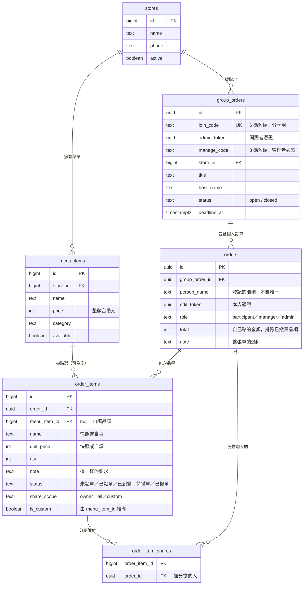

# 團購訂餐系統 — 架構設計

> 本文取代先前的「餐廳點餐系統」設計。`supabase/` 目錄下的 SQL 屬於舊設計（餐廳掃碼點餐、Supabase 直連、無 Node 後端），與本架構不相容，可刪除。

## 1. 產品定義

一群互相認識的人（同事、朋友）一起訂餐：有人**開團**並指定店家，其他人用團號加入、各自點餐並填上名字，時間到**關團**，最後產出兩份彙總——一份給店家叫餐，一份給收錢的人。

這是**內部工具**，不是對外營業系統。使用者彼此信任，這個前提決定了後面所有的權限與價格設計。

## 2. 需求對照

| 你的需求 | 設計對應 |
|---|---|
| React 前端 | Vite + React 19 + MUI，純 CSR（TanStack Router／Query） |
| 手機版為主，最大 500px 置中 | 見 §8 版面約束 |
| Node.js 後端 | Node 22 + Express + Drizzle ORM（`pg` 驅動） |
| 可選多個店家不同菜單 | `stores` ← `menu_items`，開團時綁定店家 |
| 可自填菜名和價格 | `order_items.menu_item_id` 可為 null，見 §6 |
| 點單附上自己的名字 | `orders.person_name` |
| 儲存進資料庫 | Neon Postgres |

## 3. 架構

```
┌─────────────────────────────────┐        ┌──────────────────┐
│  Zeabur — 單一 Node 服務          │        │  Neon Postgres   │
│                                 │        │                  │
│  Express                        │  TCP   │  stores          │
│   /api/*        JSON API        │───────▶│  menu_items      │
│   /*            React build 靜態 │        │  group_orders    │
│                                 │        │  orders          │
│  同一個 domain，無 CORS 問題       │        │  order_items     │
└─────────────────────────────────┘        └──────────────────┘
```

**為什麼是單一服務**：前後端同源，省掉 CORS 設定與第二個服務的維運。輕量專案不需要拆。

### 後端分層

`/api/*` 底下一律走同一條路：

```
routes/         路徑 → controller 的對照表，不放任何邏輯
   ↓
controllers/    唯一碰得到 req／res 的一層。zod 驗證 body、把 header 上的
                三組憑證讀成普通物件、把路徑參數轉成 id、決定狀態碼
   ↓
services/       商業規則的所在：權限、狀態轉移、截止時間、transaction 邊界。
                回傳的是可以直接送出的 DTO，不含 Drizzle row
   ↓
repositories/   全部的 Drizzle 查詢。第一個參數一律是 executor（db 或 tx），
                同一份查詢在交易內外共用。找不到回 null，不丟 HttpError
```

`lib/` 在這條線之外：純函式，不碰資料庫也不碰 Express（狀態機、分單、計價、序列化、zod schema）。需要查資料庫的判斷因此被切成兩半——規則留在 `lib/`，查詢那一步放進 service。身分判定是最明顯的例子：`lib/roles.js` 的 `evaluateActor` 只做「有了憑證與被指派的角色之後怎麼判」，`services/permissionService.js` 負責去把那個角色查出來。

**為什麼值得拆。** 原本三支 `routes/*.js` 各自四百行，SQL、權限判斷與 HTTP 混在同一個 handler 裡；`POST /groups/:joinCode/orders` 與 `POST /orders/:orderId/items` 是同一套計價與分單驗證，卻只能靠 `lib/pricing.js` 收留那些「其實需要資料庫」的 helper。拆開之後每一層只有一種理由會改：換 ORM 只動 repository，改權限只動 service，改 API 形狀只動 controller。分層前後 `npm run smoke` 的 158 項行為完全不變。

**冷啟動可以接受**：Zeabur 免費方案的 Node 服務會休眠。先前評估餐廳現場點餐時我判定不可接受（客人站在櫃檯等），但團購的使用節奏是「中午前陸續下單」，第一個人多等三秒無感。這是本情境相對寬鬆的地方。

## 4. 資料模型



### DDL

```sql
create table stores (
  id         bigint generated always as identity primary key,
  name       text not null,
  phone      text,
  note       text,
  active     boolean not null default true,
  created_at timestamptz not null default now()
);

create table menu_items (
  id         bigint generated always as identity primary key,
  store_id   bigint not null references stores(id) on delete cascade,
  name       text not null,
  price      int  not null check (price >= 0),
  category   text not null default '主餐',
  available  boolean not null default true,
  sort_order int  not null default 0
);

create table group_orders (
  id          uuid primary key default gen_random_uuid(),
  join_code   text not null unique,
  admin_token uuid not null default gen_random_uuid(),
  -- 管理者憑證。8 碼、人念得出來，一律連同 join_code 驗證，因此不必全域唯一
  manage_code text not null default gen_group_manage_code(),
  store_id    bigint not null references stores(id),
  title       text not null,
  host_name   text not null,
  status      text not null default 'open' check (status in ('open','closed')),
  deadline_at timestamptz,
  created_at  timestamptz not null default now()
);

create table orders (
  id             uuid primary key default gen_random_uuid(),
  group_order_id uuid not null references group_orders(id) on delete cascade,
  person_name    text not null,
  note           text,
  edit_token     uuid not null default gen_random_uuid(),
  -- 被指派的角色：participant／manager／admin，用自己的 edit_token 行使
  role           text not null default 'participant'
    check (role in ('participant', 'manager', 'admin')),
  total          int  not null default 0 check (total >= 0),
  created_at     timestamptz not null default now(),
  updated_at     timestamptz not null default now()
);

create table order_items (
  id                bigint generated always as identity primary key,
  order_id          uuid   not null references orders(id) on delete cascade,
  menu_item_id      bigint references menu_items(id),      -- null = 自填
  name              text   not null,
  unit_price        int    not null check (unit_price >= 0),
  qty               int    not null check (qty > 0),
  note              text,                                  -- 這一樣的要求
  is_custom         boolean generated always as (menu_item_id is null) stored,
  status            text not null default 'pending',       -- 狀態屬於品項，不屬於訂單
  status_changed_at timestamptz not null default now(),
  share_scope       text not null default 'owner'          -- owner / all / custom
    check (share_scope in ('owner', 'all', 'custom'))
);

-- 分單名單。只存「其他人」，不存擁有者自己
create table order_item_shares (
  order_item_id bigint not null references order_items(id) on delete cascade,
  order_id      uuid   not null references orders(id)      on delete cascade,
  primary key (order_item_id, order_id)
);

create index idx_menu_store        on menu_items   (store_id, category, sort_order);
create index idx_orders_group      on orders       (group_order_id);
create index idx_items_order       on order_items  (order_id);
create index idx_items_order_status on order_items (order_id, status);
create index idx_shares_order      on order_item_shares (order_id);
```

**設計決策**

**狀態屬於品項，不屬於訂單。** 聚會是一輪一輪點的：先點的已經到餐時，後加的還沒跟店家開口，整張單根本沒有單一狀態可言。`orders` 因此沒有 status 欄位，整張單的狀態一律由品項推導（取最落後的那一項，見 `lib/orderStatus.js` 的 `rollupStatus`）。`orders.total` 是快取，唯一的事實來源是 `order_items`，任何品項異動都要經過 `repositories/orderRepository.js` 的 `refreshTotal` 重算。

`order_items` 一律儲存 `name` 與 `unit_price`，`menu_item_id` 只是「這筆是從哪個菜單品項來的」的參照。這讓「菜單品項」與「自填品項」用同一張表表達，彙總與計價的程式碼完全不必分岔——這是支援自填功能最省事的模型。

金額一律用**整數台幣元**。浮點數在對帳時遲早出錯。

`join_code` 是 6 碼短碼（排除 `0OIl1` 等易混淆字元），因為它會被口頭念出來或貼在群組裡；`admin_token` 和 `edit_token` 則是 uuid，不需要人讀。

**一張單就是一個人。** 沒有獨立的 `participants` 表——第一次進團要先登記暱稱，登記出來的就是一張還沒有品項的 `orders`。有單才有身分：別人選得到你來分單，你之後加點也不必再打一次名字。加一張表來表達同一件事只會多出「單和人對不起來」這種需要處理的狀態。空單不算人頭（`decorateOrder` 的 `counted` 為 false），但只要有人把東西分給他就算。

**分單的金額不落地。** `order_items.share_scope` 只說明「這一樣該分給誰」，每個人實際付多少一律在讀取時由 `lib/split.js` 重算。理由是「全部平分」的分母會變——中途有人加入或退出時，若金額已經寫死在資料庫，就得回頭更新一票不相干的列，漏掉一列就是一筆對不起來的帳。重算的成本是每次讀團多跑一次全表走訪，資料量在一桌人的規模，可以忽略。

`custom` 只存其他人、不存擁有者：擁有者必然要付，而且下單當下那張單的 id 還不存在。

金額除不盡時（100 分三人），餘數以一元為單位逐一分配，起點依品項 id 輪替——固定從第一個人開始的話，排最前面的人會被每一筆除不盡的品項各多收一元。**總和永遠等於原金額**，這是 `server/smoke.js` 每一步都在驗的不變式。

### 資料存取：Drizzle，但結構仍由 SQL 決定

查詢一律走 Drizzle（`server/schema.js` 定義資料表與關聯，`server/db.js` 把它包在既有的 `pg` 連線池上）。換掉手寫 SQL 主要買到兩件事：欄位名打錯在載入時就會炸而不是上線後才回 undefined，以及讀一團訂單那段三層巢狀查詢——原本是一段帶 `json_agg` 與 `lateral` 的 SQL，現在是 `db.query.orders.findMany({ with: { items: { with: { shares: true } } } })`。連線池的設定（IPv4 優先、serverless 限一條）沒有變，Drizzle 只是查詢層。

**但結構的來源仍然是 `server/migrations/*.sql`**，不是 `drizzle-kit`。原因是那幾支 migration 的註解本身就是設計決策的一部分：0005 與 0008 刻意只加欄位不刪舊的，因為 migration 會在新版程式部署之前跑完，那段空窗期舊版還在線上讀寫；`orders.status` 與 `orders.is_manager` 至今還留在資料庫裡就是這個原因。自動 diff 產生的 migration 看不到這件事，只會把它們一起砍掉。

因此 `server/schema.js` 是「套用完之後的描述」而非來源，改結構的順序是先寫 SQL、跑 `npm run migrate`、再同步 schema。`drizzle.config.js` 只留給 `npm run db:pull`（把線上結構抓下來比對），`push` 與 `generate` 不要用。兩邊對不上時以資料庫為準——schema 寫錯只會讓查詢在執行期壞掉。

## 5. 身分與權限：無登入的 token 模型

**完全不做帳號系統。** 團購的價值在於零阻力，要求註冊會直接殺掉使用率。

改用四種憑證，對應三個角色：

| 憑證 | 誰持有 | 對應角色 | 存在哪 |
|---|---|---|---|
| `join_code` | 團裡所有人 | 看團、看所有人的訂單、登記暱稱、**改任何品項的狀態** | URL |
| `edit_token` | 下單本人 | 那張單的 `orders.role`，預設 `participant` | localStorage |
| `manage_code` | 發起人給出去的人 | `manager` | localStorage |
| `admin_token` | 開團者 | `admin`，且是唯一刪得掉整攤的人 | localStorage |

| 角色 | 能做什麼 |
|---|---|
| `participant` 參與者 | 加點、改自己那張單，**但只動得了「未點單」的品名與數量**；受截止時間限制 |
| `manager` 協助管理者 | 代改代刪**任何人**的訂單與品項、批次改狀態，不受截止時間與品項狀態限制 |
| `admin` 最高管理者 | 再加上指派別人的角色、關攤／重新開放、改截止時間、刪攤 |

伺服器端以 HTTP header 驗證（`X-Edit-Token`、`X-Manage-Code`、`X-Admin-Token`），判定集中在 `services/permissionService.js` 的 `resolveActor`（規則在 `lib/roles.js`），多個憑證同時存在時取最高的角色。前端的按鈕顯示與否只是體驗，**權限判斷一律在後端**。

**為什麼要有中間這一層。** 原本只有發起人與本人兩種身分，但發起人自己也在吃飯——收拾殘局（補價、改備註、把菜挪去分帳、跟店家點完後推進度）常常是坐在他旁邊那個人在做。把 `admin_token` 給出去可以解決，代價是那組 uuid 沒辦法用嘴巴念，而且一旦給了就收不回來——它不是一個「設定」，是一把鑰匙。

管理權因此有兩條來源，刻意等價：

```
manage_code    8 碼，開攤時產生，只有發起人看得到。念給誰，誰就是協助管理者。
               不必事先登記，所以「幫忙結帳但自己沒點東西」的人也能用。
orders.role    最高管理者在清單頁直接指派某個已登記的參與者。
               那個人用自己原本的 edit_token 就有權限，不必再傳一次代碼。
```

**最高管理者可以再指派最高管理者**，這是刻意的：發起人不會整晚盯著手機等別人來要權限。代價是他也可以把別人降回參與者，但發起人的 `admin_token` 不在 `orders` 這張表裡，永遠收得回來。

反過來，持 `manage_code` 的人只是協助管理者，**指派不了任何人**——代碼給出去就收不回來，能拿它再生出更多管理者的話就再也收束不了了。同理，被指派的 `admin` 也拿不到 `manage_code`：角色撤得掉，代碼撤不掉。

`manage_code` 一律連同 `join_code` 一起驗證，因此不需要全域唯一。

**發起人的權力全部指派得出去，包含刪攤**：指派最高管理者就是把「跟我同級」這件事講明了，硬留一項給發起人反而讓「最高」名不副實。安全感來自另一個地方——發起人的 `admin_token` 不在 `orders` 表裡，被指派的人再怎麼互相降權都動不到他，他永遠收得回來。

**點過的東西，本人就不能再改品名與數量。** 品項一旦離開「未點單」，店家那邊已經記下了品名與數量，本人再改只會讓 App 上的清單與店家手上的單對不起來——真正該做的是跟店家重講一次，所以介面把他導向「另外加點一筆」或「撤單」。同理，已點單的品項本人也不能直接刪除（會繞過這條規則，而且撤單才留得下紀錄），整張單裡只要有一樣已點單就不能整張刪掉。

只鎖品名與數量，**價格、備註與分單仍然可以改**：自填品項常常是「先點了，結帳才知道多少錢」，價格待確認要靠本人補；分單也多半是結帳當下才喬。這些一起擋掉只會把所有工作推回發起人身上，而那正是加管理者這一層要解決的問題。發起人與管理者不受此限。

**品項狀態是唯一不需憑證的寫入。** 現場誰看到餐送上桌誰就按得掉——服務生把酒端來時，點的人可能正在廁所，要求本人操作等於這個功能不會被用。拿得到團號就是同一桌的人，而且能改的只有進度，改不了金額與內容。代價是同桌的人可以亂按彼此的狀態，而且沒有紀錄是誰按的；這在聚會情境下可以接受，換成陌生人的場景就不行。

已知取捨：知道團號的人可以看到團內所有人點了什麼。辦公室情境下這本來就是公開資訊（大家要一起看彙總），因此接受。

## 6. 價格信任模型

這是本系統最需要小心的地方。「自填價格」表示**不能像一般點餐系統那樣完全不信任前端**，但也不該因此全盤開放。

分兩種情況處理，判斷依據是前端有沒有送 `menuItemId`：

```
有 menuItemId  → 忽略前端送的 name 與 price
                 從 menu_items 讀取真實資料
                 驗證該品項屬於本團的 store 且 available

無 menuItemId  → 採用前端送的 name 與 price（自填）
                 驗證 name 非空且 ≤ 50 字
                 驗證 price 介於 0 ~ 200000
```

`total` **永遠由伺服器重算**，前端送來的金額一律丟棄。

換句話說，信任只開放到「自填品項」這個範圍內，菜單上的品項依然由伺服器決定價格。這樣可以避免「有人不小心把 90 元的排骨飯改成 9 元」這種非惡意但會造成對帳混亂的狀況。

## 7. API 契約

> 逐一端點的請求／回應欄位、驗證限制、錯誤碼與程式操作範例見 **[docs/API.md](API.md)**。本節只列輪廓。

```
# 店家與菜單（無需憑證）
GET    /api/stores                          列出啟用中的店家
POST   /api/stores                          新增店家
PATCH  /api/stores/:id                      修改店家資訊（name／phone／note）
DELETE /api/stores/:id                      軟刪除店家
GET    /api/stores/:id/menu                 取得店家菜單（含下架品項）
POST   /api/stores/:id/menu                 新增菜單品項
POST   /api/stores/:id/menu/bulk            一次匯入整份菜單（整批成立或退回）
PATCH  /api/menu-items/:id                  修改／上下架
DELETE /api/menu-items/:id                  刪除品項

# 團
POST   /api/groups                          開團 → { joinCode, adminToken, manageCode }
GET    /api/groups?storeId=&title=          查同名收單中的團
GET    /api/groups/:joinCode                團資訊 + 菜單 + 所有訂單 + 彙總
                                            （帶憑證才回 group.manageCode）
POST   /api/groups/:joinCode/manage-code    驗證管理代碼
PATCH  /api/groups/:joinCode                關攤／改截止時間   [最高管理者]
DELETE /api/groups/:joinCode                刪攤（cascade）    [最高管理者]
PATCH  /api/groups/:joinCode/orders/status  批次改品項狀態     [管理者以上]

# 個人訂單
POST   /api/groups/:joinCode/orders         登記暱稱／送出訂單 → { orderId, editToken }
                                            （items 可為空 = 只登記）
PATCH  /api/orders/:orderId                 改暱稱／備註        [本人或管理者以上]
POST   /api/orders/:orderId/items           加點（追加品項）    [本人或管理者以上]
DELETE /api/orders/:orderId                 刪除整張單          [本人或管理者以上]
PATCH  /api/orders/:orderId/role            指派角色           [最高管理者]

# 單一品項
PATCH  /api/order-items/:itemId             改數量／品名／價格／備註／分單
                                                                [本人或管理者以上]
DELETE /api/order-items/:itemId             刪掉其中一樣        [本人或管理者以上]
PATCH  /api/order-items/:itemId/status      改品項狀態          （不需憑證）
PATCH  /api/orders/:orderId/status          整張單一次改狀態    （不需憑證）
```

「管理者以上」＝ `manager` 或 `admin`；「最高管理者」＝ `admin`。參與者動已點單的品項時，品名與數量會被擋下（見 §5）。

**沒有「整筆覆蓋」的改單 API。** 覆蓋會把已經跟店家點過、甚至已經到餐的品項連同狀態一起洗掉，所以改單拆成三個各自獨立的動作：加點只追加、改內容只動一列、刪除只刪一列。這也是「已經送單後還能繼續點」能成立的前提。

送單 payload：

```jsonc
{
  "personName": "小明",
  "note": "我晚點到",                                          // 整張單的通則
  "items": [
    { "menuItemId": 12, "qty": 1, "note": "不要香菜" },        // 菜單品項，價格由伺服器決定
    { "name": "自己加的珍奶", "unitPrice": 60, "qty": 2 },      // 自填品項
    { "menuItemId": 30, "qty": 1, "shareScope": "all" },       // 全團平分
    { "menuItemId": 31, "qty": 1,                              // 指定的人一起分
      "shareScope": "custom", "sharedWith": ["<orderId>"] }
  ]
}
```

`items` 可以是空陣列——那就是「只登記暱稱」。

`GET /api/groups/:joinCode` 的回應包含三份彙總，因為這是本系統真正的產出：

- **依品項彙總**：合併所有人的相同品項 → 給店家叫餐用
- **依人彙總**：每個人的應付金額（`payable`，已含分單）→ 給收錢的人用
- **分單一覽**（`summary.split`）：哪幾樣被分著付、每個人各分到多少 → 有人覺得金額不對時，答案在這裡

`ownTotal`（自己點了多少）與 `payable`（自己要付多少）在有分單時是兩個不同的數字，收錢一律看 `payable`。

## 8. 前端結構與版面約束

### 版面

```
最大寬度 500px，水平置中
單欄，不做響應式斷點（桌機上就是中間一條）
主要操作固定在底部（拇指可及）
可點擊目標最小 44×44px
頁首固定顯示：團名、店家、截止時間倒數
```

骨架在 `components/ui.jsx` 的 `Layout`：`maxWidth: 500`、`mx: 'auto'`、`minHeight: '100dvh'`。用 `100dvh` 而非 `100vh`，避免手機瀏覽器網址列造成的高度跳動。

### 路由（TanStack Router，純 CSR）

| 路由 | 內容 | loader 預先備好 |
|---|---|---|
| `/` | 開新團 ／ 輸入團號加入 | —（本機清單，進頁面才逐團校正） |
| `/new` | 開團：選店家、團名、你的名字、截止時間 | 店家列表 |
| `/g/$joinCode` | 團主頁，三個 tab：**點餐** ／ **清單** ／ **結帳** | 整攤實況 |
| `/stores` | 店家列表 ＋ 新增店家（可一併貼上菜單） | 店家列表 |
| `/stores/$storeId` | 單一店家的菜單管理 | 店家列表 ＋ 該店菜單 |
| 其他 | 一律導回 `/`（`defaultNotFoundComponent`） | — |

route tree 寫在 `router.jsx`（code-based，不用檔案系統路由與 codegen——五條路由不值得多一層產生的檔案）。每條路由的 `loader` 只做一件事：`queryClient.ensureQueryData(...)`，所以畫面掛上去時資料已經在 Query 的快取裡，元件那一側照常 `useQuery` 讀同一個 key，不需要另外傳 loader 的回傳值。`defaultPreload: 'intent'` 讓連結在滑過時就先把 loader 跑掉。

團主頁的三個 tab 是元件內的 state 而不是路由：手機上用 tab 而非多頁，可以避免來回導航時遺失捲動位置。菜單管理則刻意獨立成一條路由——那一頁的「退出一層」就是按返回鍵，該回到店家列表，而不是把整個管理頁關掉。

### 伺服器資料：TanStack Query

所有讀取都經過 `lib/queries.js` 的 query options（`storesQuery` / `menuQuery` / `groupQuery` / `similarGroupsQuery`），key 集中在同一個 `keys` 物件。幾個刻意的決定：

- **憑證不進 query key。** `editToken` / `adminToken` / `manageCode` 存在 localStorage，`groupQuery` 的 `queryFn` 在發請求當下才去讀。憑證進 key 會讓同一攤在快取裡分裂成好幾份；改為「凡是動到憑證的動作都 invalidate 這個 key」。
- **寫入一律走 `useAppMutation`**（`lib/queries.js`）：成功後把 `invalidates` 列出的 key 重讀一輪，取代改版前散在各元件的 `onChanged` / `onSaved` 回呼鏈。呼叫端的 `onSuccess` 先跑、重讀後跑——它改的通常是 localStorage 憑證或本機狀態，而那一次重讀會用到（最明顯的是剛驗過的管理代碼）。
- **團主頁每 15 秒輪詢一次**，分頁切到背景時停止；再加上 `refetchOnWindowFocus`。大家坐在同一桌，別人剛加了什麼、餐到了沒有，本來就得重讀才看得到。頂上的重新整理按鈕留給「我現在就要看到」。
- **4xx 不重試**（`queryClient.js`）：代碼打錯、團被刪掉、憑證不夠，再試幾次也是同一個答案。

### 檔案結構

```
client/src/
├── main.jsx                     QueryClientProvider ＋ RouterProvider
├── router.jsx                   route tree、loader、pending／error／notFound 畫面
├── queryClient.js               Query 全域預設：staleTime、4xx 不重試、切回分頁重讀
├── lib/api.js                   fetch 封裝，錯誤帶 HTTP status
├── lib/queries.js               query keys／query options ＋ useAppMutation
├── lib/storage.js               localStorage：憑證、名字、參與過的團
├── lib/orderStatus.js           狀態顯示設定（轉移規則與後端一致）＋ 品項可改與否
├── lib/roles.js                 角色顯示設定（與後端 auth.js 一致）
├── lib/menuCsv.js               菜單 CSV 解析與範本
├── pages/
│   ├── Home.jsx                 開團／加入／最近參與的（會自動校正已刪除的）
│   ├── NewGroup.jsx
│   ├── Group.jsx                含三個 tab
│   ├── Stores.jsx               店家列表 ＋ 新增店家
│   └── StoreMenu.jsx            單一店家的菜單管理
└── components/
    ├── ui.jsx                   Layout／Header／金額顯示等共用零件
    ├── OrderTab.jsx             登記暱稱 ＋ 菜單 ＋ 加點清單（置底可收合）
    ├── ItemStatusChip.jsx       單一品項的狀態，點一下就能改
    ├── ItemEditDialog.jsx       改品名／價格／數量／備註／分單（加點清單與已送出共用）
    ├── ShareSelect.jsx          這一樣誰要付：我自己／全部平分／指定的人
    ├── MenuCsvImport.jsx        貼上 CSV 批次匯入菜單，含範本複製／下載
    ├── GroupManage.jsx          清單頁最上面：進度明細＋批次、參與者權限（管理者限定）
    ├── ManageCodeCard.jsx       清單頁最底下：顯示或輸入管理代碼
    ├── PeopleList.jsx           所有人的訂單，自己置頂；狀態誰都能改，內容需憑證
    └── Summary.jsx              叫餐清單 ＋ 這一輪 ＋ 分帳 ＋ 分單一覽

server/
├── index.js                     Express 啟動 + 靜態檔
├── db.js                        pg Pool ＋ Drizzle 實例
├── schema.js                    Drizzle schema（資料表、索引、關聯）
├── routes/{stores,groups,orders}.js         路徑 → controller
├── controllers/{store,menu,group,order}Controller.js + http.js
├── services/{store,menu,group,order,permission,item}Service.js
├── repositories/{store,menuItem,group,order,orderItem}Repository.js
├── lib/{roles,codes,pricing,validate,orderStatus,split,serialize,errors}.js
└── migrations/000*.sql          結構的來源，schema.js 是套用後的描述
```

**菜單為什麼要能貼 CSV。** 新開一家店最花時間的不是填店名，是後面那幾十樣品項，而那份菜單通常已經以某種表格形式存在了（照片打的、上次的試算表、店家給的清單）。解析放在**前端**：貼上之後要先看得到「這 23 樣會進去、第 5 行有問題」才敢按下去，錯誤得指到第幾行；後端因此只收乾淨的陣列，而且整批寫在一個 transaction 裡——有一列不合法就整批退回，不會留下匯入到一半的菜單讓人不知道從哪裡接。

**進度為什麼在「清單」而不是「結帳」。** 想知道「這一輪還有誰沒點到」的時機，就是在看誰點了什麼的當下——兩者是同一件事，隔一個 tab 只會讓人來回切。結帳頁留給金額。進度只給管理者看：一般參與者只想知道自己點了什麼、多少錢，全攤的統計對他是雜訊，批次按鈕更不該出現在他面前。它也不只給數字——要跟店家開口的人得知道那三樣「未點單」到底是什麼、誰點的。

**「我的單」為什麼不在點餐頁。** 點餐頁真正的工作是挑東西；挑完送出的結果跟別人送出的結果是同一份資料，分在兩個 tab 只會讓人為了確認自己點了什麼一直切回去。已送出的品項因此一律在清單頁看與改，自己那張置頂。點餐頁只留購物車，而且出現兩次：上面那份給剛挑完的人，置底收合的那份給已經滑到菜單深處、想確認一下再送出的人。

**狀態歸屬**：購物車在送出前只存在前端；`editToken` / `adminToken` / `manageCode` 與參與過的團存 localStorage；其餘一切以資料庫為唯一真實來源，前端只透過 TanStack Query 快取它，不另外複製一份到元件 state。

## 9. 關鍵流程

**開團**

```
開團者  →  POST /api/groups { storeId, title, hostName, deadlineAt }
        ←  { joinCode: "K7M2QX", adminToken, manageCode: "5PV2XXAD" }
        存 adminToken 到 localStorage，分享 /g/K7M2QX 連結
        manageCode 不必存——之後帶 adminToken 讀團就會再回傳一次，
        顯示在清單頁供發起人念給幫忙的人
```

**參加者下單**

```
參加者  →  GET  /api/groups/K7M2QX            取得菜單與現有訂單
        →  POST /api/groups/K7M2QX/orders    第一次：只帶 personName，items 為空
              伺服器：建立一張沒有品項的單 = 登記暱稱
        ←  { orderId, editToken }            存起來，這一團的身分就固定了

        →  POST /api/orders/:orderId/items   之後一律走加點，不必再送名字
              伺服器：驗證團未關閉且未逾期
                     菜單品項改用 DB 價格
                     自填品項驗證範圍
                     分單對象必須是同一團的人
                     寫入 order_items + order_item_shares、重算 total
                     （單一 transaction）
        ←  { addedItemIds, total }
```

**關團與結算**

```
開團者  →  PATCH /api/groups/K7M2QX { status: "closed" }  [X-Admin-Token]
        →  GET   /api/groups/K7M2QX  → 依品項彙總（給店家）
                                        依人彙總（給收錢）
```

## 10. 部署

| 層 | 平台 | 方案 |
|---|---|---|
| Node + React 靜態檔 | Zeabur | Free（可接受冷啟動）或 Developer $5/月 |
| 資料庫 | Neon | Free，不休眠，喚醒約 0.5 秒 |

`zbpack.json`：

```json
{
  "node_version": "22",
  "build_command": "npm ci && npm run build",
  "start_command": "node server/index.js"
}
```

**環境變數**

| 變數 | 說明 |
|---|---|
| `DATABASE_URL` | Neon 連線字串，需 `?sslmode=require` |
| `PORT` | Zeabur 注入，程式必須讀取且 listen 在 `0.0.0.0` |

Neon 建議使用 **pooled connection**（連線字串含 `-pooler`），因為 serverless 環境的連線會頻繁建立與釋放。

## 11. 已知限制與風險

| 項目 | 影響 | 處理 |
|---|---|---|
| 無帳號系統 | 知道團號即可看全團訂單 | 辦公室情境接受；團號不可猜 |
| `edit_token` 存 localStorage | 換手機或清快取後改不了自己的單 | 開團者持 `admin_token` 可代改代刪 |
| `manage_code` 給出去收不回來 | 拿到的人一直是協助管理者，直到整攤結束 | 要能收回請改用逐一指派（清單頁的權限下拉） |
| 管理代碼可被暴力猜 | 有團號的人可以一直試 | 8 碼 ÷ 31 字元 ≈ 8.5×10¹¹ 種；目前**沒有速率限制**，多實例部署下也不好做，接受 |
| 管理者的操作沒有紀錄 | 不知道是誰改了誰的單 | 與品項狀態同樣的取捨；聚會情境接受 |
| 最高管理者可以互相降權 | 被指派的兩個人可以把對方降回參與者 | 發起人的 `admin_token` 不在 `orders` 表裡，永遠收得回來 |
| 沒有自動更新 | 別人剛加的東西要重讀才看得到 | 頁首給了一顆重新整理；輪詢見 ROADMAP |
| 自填價格無法驗證 | 打錯價格會影響對帳 | 彙總頁把自填品項標示出來，讓大家核對 |
| 截止時間 | 只擋前端等於沒擋 | 伺服器端在送單時檢查 `status` 與 `deadline_at` |
| 重複送單 | 連點兩次產生兩筆 | 送出後停用按鈕；同團同暱稱由唯一索引擋下並要求區隔 |
| 分單「全部平分」 | 分母隨參與者變動，先算過的人金額會跟著變 | 刻意如此：金額不落地，一律重算。晚到的人本來就該一起分 |
| 分單零頭 | 100 分三人，總有人多付一元 | 依品項 id 輪替分配；總和永遠等於原金額 |
| 換裝置後身分遺失 | 會被要求重新登記，變成第二個人 | 開團者可代刪重複的空單；`edit_token` 仍存 localStorage |
| 冷啟動 | 第一個開團的人等數秒 | 接受；介意則升級 Developer 方案 |
| Neon 免費容量 | 約 0.5GB | 團購資料量極小，數年無虞 |

## 12. 演進路線

| 需求 | 做法 |
|---|---|
| 記錄誰付過錢 | `orders` 加 `paid_at` |
| 複製上次的團 | 依既有 `group_order_id` 複製設定 |
| 常用品項 | 由歷史 `order_items` 統計，自填品項自動建議 |
| 匯出給店家 | 彙總頁產生純文字，一鍵複製貼到 LINE |
| 真正的帳號 | 加 `users` 表，`orders.person_name` 改為 `user_id` |
| 多團同時進行 | 目前已支援，`/` 頁可加「我參與過的團」列表（由 localStorage 推導） |
